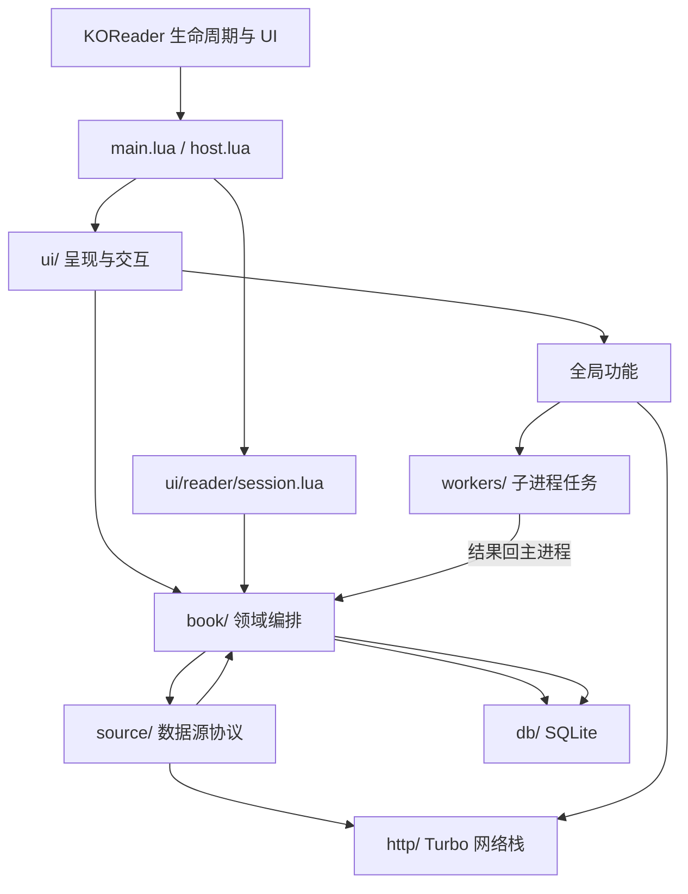
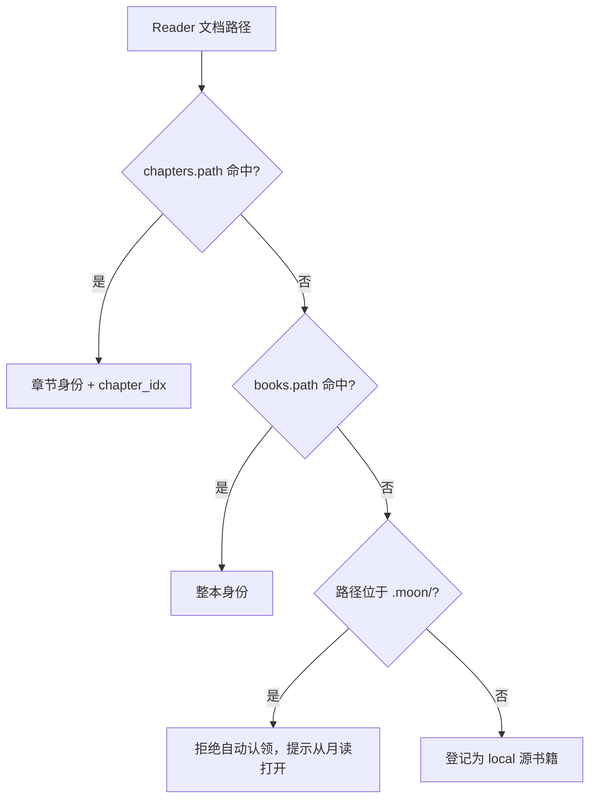
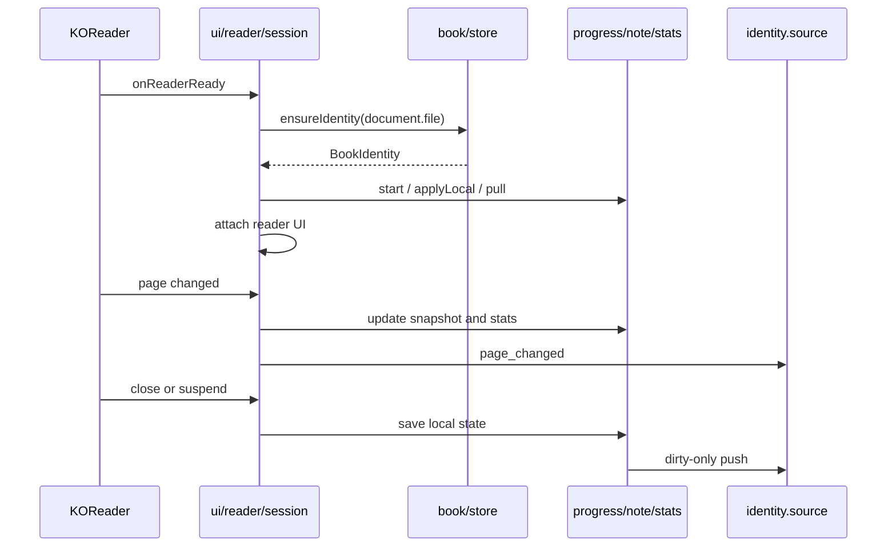

# 月读系统设计

> 适用版本：当前 `book.koplugin/`
>
> 这是一份实现文档，不是未来架构提案。模块边界、数据所有权、异步契约和 UI 组件以代码为准。

月读是运行在 KOReader 内的纯 Lua/LuaJIT 插件。唯一交付物是 `book.koplugin/`，不引入独立运行时，不复制 KOReader 已有的阅读器能力。系统围绕一个核心事实组织：书籍身份由物理路径解析，业务状态按 `(source_id, stable_id)` 隔离，所有网络源最终收敛到本地数据库供 UI 读取。

# 第一部分：系统架构

## 1. 设计目标与边界

### 1.1 目标

- 在 KOReader 之上提供统一书库、数据源、同步、统计和阅读增强。
- 网络不可用时仍能浏览已同步书库、打开已缓存书籍并记录阅读状态。
- 整本文件与按章内容共享同一套书籍身份、详情、统计和同步模型。
- FileManager、Reader、锁屏和远程服务使用同一份持久化数据，不维护互相冲突的副本。
- 耗时 IO 不阻塞 UI；SQLite 和 KOReader UI 只在主进程访问。

### 1.2 非目标

- 不替代 KOReader 的排版、渲染、文档格式支持和基础阅读交互。
- 不把远程服务、Z-Library、锁屏或拼音实现伪装成数据源。
- 不为假想扩展增加 Service、Manager、Factory 等转发层。
- 不在插件外维护必须参与运行的构建产物或依赖。

### 1.3 兼容性原则

- 已写入 `.moon/` 的配置、数据库和缓存路径是用户数据契约。
- 数据源能力决定 UI 入口；不支持的功能隐藏或明确禁用。
- 切换当前数据源不能改变已打开书籍的属主源。
- 网络同步失败必须保留本地脏数据，不能用旧远端值覆盖新本地值。

## 2. 总体分层



依赖方向必须保持单向：

1. `main.lua` 只接 KOReader 事件并转交下游，不承载业务规则。
2. `ui/` 读取领域结果并触发动作，不直接实现远端协议。
3. `book/` 拥有身份、进度、笔记、统计和同步编排。
4. `source/` 适配外部系统；默认查询本地 catalog，远端结果写回本地。
5. `db/` 是 SQLite 的唯一访问层。
6. `workers/` 只处理文件、解析和计算，不接触 UI 或数据库。

## 3. 目录结构

| 路径 | 责任 | 关键入口 |
|---|---|---|
| `main.lua` | KOReader 生命周期接线、桌面打开、源事件分发 | `BookPlugin:init`、`openDesktop`、`emitToSource` |
| `host.lua` | 菜单、Dispatcher、启动行为和 FileManager 宿主 | `Host.attach`、`Host.onShow` |
| `book/` | 书籍领域：身份、打开、目录、进度、笔记、统计、同步、重排 | `store.lua`、`open.lua`、`progress.lua`、`note.lua`、`stats.lua` |
| `source/` | 数据源基类、注册表、三种源和按章公共逻辑 | `base.lua`、`registry.lua`、`chapter.lua` |
| `db/` | SQLite 连接、schema 和参数化查询 | `base.lua`、`book.lua`、`chapter.lua`、`progress.lua` |
| `ui/desktop/` | 首页、图书馆、书城、统计、详情和设置 | `ui/desktop.lua` |
| `ui/reader/` | 阅读会话、状态条、划词菜单和结束处理 | `session.lua`、`bars.lua` |
| `ui/panel/` | 注入 KOReader 原生顶部菜单的桌面/阅读快捷动作 | `native.lua`、`actions/registry.lua` |
| `ui/components/` | 墨水屏公共组件和视觉度量 | `bookui.lua`、`bookinfo.lua`、`pager.lua` |
| `http/` | Turbo 非阻塞请求、Header 和 HTTP 缓存 | `request.lua` |
| `workers/` | 子进程 Job、主线程 SimpleJob 和进程上下文 | `job.lua`、`simple_job.lua` |
| `remote/` | 局域网 HTTP 服务、文件、输入、剪贴板和静态页面 | `init.lua`、`server.lua` |
| `lockscreen/` | 背景、主体、布局、离屏渲染和 KOReader 锁屏设置 | `init.lua`、`compose.lua` |
| `pinyin/` | 中文键盘 hook、候选栏、词库查询和分片下载 | `init.lua`、`candidate_bar.lua` |
| `dictionary/` | StarDict 下载、安装、启停和 ReaderDictionary 接管 | `init.lua`、`manager.lua` |
| `translate/` | Edge 翻译和翻译弹窗 | `init.lua`、`edge.lua` |
| `baike/` | 百度百科查询和 ReaderWikipedia 接管 | `init.lua`、`client.lua` |
| `ai/`、`ai.lua` | OpenAI 兼容接口、SSE 和 JSON 提取 | `ai.lua`、`client.lua` |
| `xray/` | 人物、地点、专有名词提取、存储、标记和查询 | `fetch.lua`、`store.lua`、`marks.lua` |
| `zlib/` | 全局 Z-Library 书城；不是 `BookSource` | `init.lua`、`client.lua` |
| `scrape/` | 豆瓣、微信读书元数据搜索与本地书刮削 | `search.lua`、`ui.lua` |
| `convert/` | TXT/MOBI 到 EPUB 的转换任务 | `text2epub.lua`、`mobi2epub.lua` |
| `patch/`、`patches/` | KOReader 核心补丁安装、备份和翻页动画补丁 | `patch/manager.lua` |
| `utils/` | 路径、配置、日志、文字和性能原语 | `paths.lua`、`settings.lua`、`text.lua` |
| `types/` | LuaLS 纯表结构注解 | `book.lua`、`book_source.lua` |
| `l10n/` | 英文和繁体中文资源 | `en.lua`、`zh_TW.lua` |

源模块顶层不得加载 KOReader UI 模块。网络状态、弹窗等 UI 依赖必须在函数内延迟加载，否则离线测试无法直接加载源实现。

## 4. 运行时与生命周期

KOReader 会分别为 FileManager 和 Reader 创建插件实例。Reader 实例只服务当前文档；关书后由 FileManager 实例承载月读桌面。`main.lua` 因此是事件接线板，而不是全局单例。

### 4.1 初始化

```text
BookPlugin:init
├── 启动日志与 Turbo
├── Host 菜单和启动行为
├── 翻译 / 百科 / 词典 hook
├── 原生顶部菜单动作
├── 锁屏与远程服务
├── 截图分享与拼音候选栏
├── KOReader 补丁管理
└── Reader 实例发出 reader_open
```

Turbo 必须在 `UIManager:run()` 前启用。可选增强初始化失败时应记录真实错误，但不能让无关阅读主流程整体失效。

### 4.2 KOReader 事件映射

| KOReader 事件 | 处理 |
|---|---|
| `onShow` | FileManager 宿主接管；发出 `fm_open` |
| `onDocSettingsLoad` | 将全书阅读偏好注入当前文档 sidecar |
| `onReaderReady` | 建立阅读会话、解析身份、启动统计和阅读 UI |
| `onCloseDocument` | 保存偏好、进度、笔记和统计；区分切章与真关书 |
| `onStartOfBook` / `onEndOfBook` | 按章模式切换相邻章节 |
| `onPageUpdate` / `onPosUpdate` | 更新快照、统计和阅读状态条 |
| `onAnnotationsModified` | 按当前身份保存完整注解快照 |
| `onSuspend` | 结清阅读状态、生成锁屏、停止远程服务 |
| `onResume` | 恢复统计、锁屏、远程服务和桌面数据 |
| `onNetworkConnected` | 重试脏数据、通知源、刷新锁屏 |
| `onExit` | 停止远程服务并刷日志 |

### 4.3 数据源事件

`plugin:emitToSource(event, payload, source)` 是唯一生命周期分发入口。第三个参数用于指定书籍属主源；省略时才使用当前活跃源。

| 事件 | 语义 |
|---|---|
| `reader_open`、`fm_open` | 对应插件实例已创建或显示 |
| `desktop_open`、`desktop_resume`、`home_open` | 桌面可见；基类按节流策略同步书架和统计 |
| `library_refresh_request` | 用户要求强制刷新 |
| `document_close`、`suspend` | 阅读状态已开始结清 |
| `chapter_changed` | 按章会话完成切章 |
| `network_connected` | 网络恢复 |
| `page_changed` | 属主书籍页码变化 |
| `book_info_request` | 阅读面板请求最新书籍信息 |

## 5. 书籍身份与数据所有权

### 5.1 唯一身份

所有业务数据使用 `(source_id, stable_id)` 隔离；`chapter_idx` 只表示同一本书中的章节位置，不参与书籍主键。

```text
BookIdentity
├── source_id
├── stable_id
├── chapter_idx?    # 非 nil 即按章模式
├── book?           # 本地元数据快照
└── source?         # ensureIdentity 解析出的属主源实例
```

当前数据源是 UI 选择，属主源是书籍身份的一部分，两者不能混用。打开旧来源书籍时，必须使用 `identity.source`；拿 `registry.current()` 同步会把进度、笔记和统计写到错误来源。

### 5.2 路径解析规则

`book/store.lua` 只有一条身份解析规则：物理路径精确查库。



在线章节只有在文件落地后，才通过 `Store.touch` 在同一事务登记最新元数据、`books.path`、目录和 `chapters.path`。未知 `.moon/` 文件不能猜身份，否则缓存残片会污染进度。

### 5.3 所有权

| 数据 | 所有者 | 消费者 |
|---|---|---|
| 书籍元数据和书架成员 | `books` 表；数据源同步负责收敛 | `book/catalog.lua`、桌面 UI |
| 章节路径映射 | `chapters` 表 | `book/store.lua`、阅读会话 |
| 本地进度与同步状态 | `pending_progress` | `book/progress.lua`、数据源 |
| 注解快照 | `notes` | `book/note.lua`、数据源 |
| 阅读统计 | `reading_stats` | `book/stats.lua`、统计页、数据源 |
| HTTP 响应缓存 | `http` | `http/cache.lua` |
| X-Ray 实体 | `xray_entities` | `xray/store.lua`、阅读 UI |
| 当前阅读会话 | `ui/reader/session.lua` | Reader 生命周期处理 |
| 当前活跃数据源 | `source/registry.lua` | 桌面和设置 |

UI 不拥有业务数据。页面状态只保存加载中、分页、筛选和请求代次等瞬时信息。

## 6. 持久化设计

### 6.1 文件布局

```text
$DATA/.moon/
├── book.sqlite3
├── book.log
├── dictionary.sqlite3
├── cache/
│   ├── image/
│   └── <source>/
│       ├── book/<md5(stable_id)>/
│       └── image/
├── settings/
│   ├── common.lua
│   ├── <source>.lua
│   └── <feature>.lua
├── screensaver/
├── backups/patches/
└── fonts/
```

`stable_id` 可能包含斜杠，不能直接作为目录名。`utils/paths.lua` 使用 `md5(stable_id)` 生成同源内稳定且安全的工作目录。

### 6.2 SQLite

`db/base.lua` 维护主进程内唯一连接，启用 WAL 和 `busy_timeout=5000`。schema 由各 `db/*.lua` 按固定顺序在事务中建立。

| 表 | 主要内容 |
|---|---|
| `books` | 元数据、物理路径、目录缓存、阅读偏好、书架状态 |
| `chapters` | 章节文件路径到书籍身份和章序号的映射 |
| `pending_progress` | 本地进度和同步状态 |
| `notes` | 按书籍/章节保存的注解快照 |
| `reading_stats` | 阅读时段、页数和同步状态 |
| `http` | 可失效的 HTTP 响应缓存 |
| `xray_entities` | 人物、地点和专有名词 |

所有动态值必须绑定到 SQL 参数。数据库访问在当前进程同步执行；`db/base.lua` 会直接拒绝 worker 子进程访问。

## 7. 数据源模型

### 7.1 注册表

`source/registry.lua` 注册 `moon`、`wechat`、`local` 三个源：

- 同一时间只有一个活跃实例。
- `current()` 严格按配置创建，不做静默 fallback。
- `resolve(id)` 在身份与当前源不同时创建非活跃属主实例，不改变用户选择。
- 切换源先创建候选实例，成功后再原子替换并关闭旧实例。
- 活跃源不能被禁用；旧配置没有 `enabled_sources` 时保持全部启用。

### 7.2 基类契约

`source/base.lua` 提供本地 catalog 查询，以及进度、笔记和统计的公共同步编排。源只覆盖真实支持的远端传输方法。

- IO 方法使用 `XxxAsync(..., cb)`，可取消时返回 `{ cancel }`。
- 不支持的同步方向异步返回 `skipped`，不能伪造成功数据。
- `recentBooksAsync`、`listLibraryAsync`、`filtersAsync` 和 `readingInsightAsync` 默认读取本地数据库。
- 桌面先渲染本地结果，再由后台同步回调刷新。
- 回调必须检查桌面是否关闭、数据源是否变化、请求是否过期。

### 7.3 能力矩阵

| 能力 | 本地 `local` | 月读服务 `moon` | 微信读书 `wechat` |
|---|---|---|---|
| 阅读形态 | 整本文件 | 整本文件 | 连续章节 |
| 稳定 ID | 文件绝对路径 | 远端文件名 | 微信 `bookId` |
| 书架来源 | 扫描本地目录 | 服务端书架 | 微信书架 |
| 打开方式 | 直接打开路径 | 下载并校验后打开 | 下载章节 HTML 后打开 |
| 远端进度 | 无 | 双向同步 | 双向同步 |
| 远端笔记 | 无 | 双向同步 | 微信注解协议 |
| 远端统计 | 无 | 支持 | 支持 |
| 编辑/刮削 | 支持 | 不支持 | 不支持 |
| 源内书城 | 无 | 无 | 支持 |
| 全本章节缓存 | 不适用 | 不适用 | 支持 |

Z-Library 位于顶层 `zlib/`，是全局书城而不是第四种 `BookSource`。下载结果仍通过当前来源的导入能力进入书库。

## 8. 核心数据流

### 8.1 打开书籍

```text
UI 选择 Book
→ book/open.lua 按 book.source_id 解析属主源
→ source:openBookAsync
→ 文件下载/准备完成
→ Store.touch 同步登记物理路径
→ KOReader ReaderUI 打开文档
```

文件登记失败时不能继续打开，否则 ReaderReady 无法恢复可靠身份。

### 8.2 阅读会话



`ReaderSessionSnapshot` 随单个文档创建和销毁；按章阅读的章节会话跨 `switchDocument` 保留，直到真正关书。是否按章只看 `chapter_idx`。

关书时只上推本地新进度，不立即回拉。部分远端服务存在收敛延迟，立即回拉会用旧值覆盖刚上传的新值。

### 8.3 全量同步

`book/sync.lua` 按书架、进度、笔记、统计顺序执行。网络恢复只重试已持久化的脏数据。任一远端失败不能删除本地待同步状态。

### 8.4 章节阅读

`source/chapter.lua` 提供按章来源的公共打开、预取和切章逻辑。起始章优先级为：

1. 本地待同步进度；
2. `books.last_chapter_idx`；
3. 远端进度。

目录优先使用数据库缓存；进度章序超出缓存时丢弃缓存并重新拉取一次。

## 9. 异步与并发边界

| 机制 | 用途 | 允许访问 |
|---|---|---|
| Turbo + `http/request.lua` | 所有外部 HTTP | 网络；回调回到 UI 编排 |
| `workers/job.lua` | 重文件 IO、解析、转换、校验 | 文件系统和纯计算 |
| `workers/simple_job.lua` | 主线程下一 tick 的短任务 | UI、SQLite，但不能执行重活 |
| `UIManager:scheduleIn/nextTick` | UI 延迟、节流和状态刷新 | KOReader 主线程 |
| `remote/server.lua` 状态机 | LuaSocket 增量 HTTP | 注入的受限 IO handler |

必须遵守：

- worker 输入输出只能是可序列化数据。
- worker 不得加载 `db/`、操作 Widget 或持有 KOReader 对象。
- 解析结果回主进程后再写数据库。
- 异步回调使用 request token、generation、`Session.isCurrent` 或 `Store.isCurrentDocument` 丢弃旧结果。
- 取消只阻止后续副作用，不能留下“加载中”状态或半写文件。

## 10. 全局功能

### 10.1 远程管理

`remote/server.lua` 是零 UI 依赖的 LuaSocket HTTP 状态机，`remote/init.lua` 注入文件、输入、剪贴板和配置 handler，并负责启动、休眠停止、唤醒恢复。

文件操作只允许落在解析后的受管根目录中：KOReader 父目录、书籍根、字体目录、插件目录和本插件目录。HTML/CSS/JS 经静态路由下发，不做模板注入。

### 10.2 组合锁屏

```text
Background.ensure
× 可选压暗
× components/*.blocks
× layout.panel
→ render.lua
→ compose.png
→ KOReader screensaver 设置
```

锁屏先完整生成新文件，再替换当前图片。失败时保留上一张可用图片。新增主体只需要一个 `lockscreen/components/` 模块和注册表一项。

### 10.3 拼音

`pinyin/candidate_bar.lua` hook `VirtualKeyboard` 的 `init/addKeys/addChar/delChar`。候选栏用自足 `Strip` 替换中文键盘首行；不修改通用 IME 包装结构。

词库由 `pinyin/download.lua` 下载 manifest 和分片，worker 校验、拼接后原子落到 `.moon/dictionary.sqlite3`。文件变化后必须重置 `pinyin/dictionary.lua` 的连接与负缓存。

### 10.4 AI 与阅读工具

- `ai.lua` 是 OpenAI 兼容 Chat API 门面。
- X-Ray 使用 AI 提取结构化实体，写入 `xray_entities` 后由阅读页标记和查询。
- 翻译、百度百科和词典分别接管 KOReader 对应入口，不复制阅读器主体。
- 网络客户端统一经过 `http/request.lua`，不能各自引入同步 `socket.http`。

## 11. 测试设计

离线测试由 `tests/run.lua` 自研 runner 执行，目录镜像 `book.koplugin/`：

```text
book.koplugin/book/store.lua
tests/book/store_spec.lua
```

- `tests/run.sh` 创建 `test/` 沙箱并通过 `KO_HOME` 注入数据目录。
- `tests/support/stubs.lua` 只模拟测试实际触达的 KOReader 模块。
- `Stubs.flush()` 同步冲刷 `nextTick` 和 `scheduleIn`。
- 每个 spec 前恢复 `package.preload`、`package.loaded`、`os` 和 `io` 基线。
- 0 断言文件直接失败，防止假绿。
- 模拟器 `./run.sh` 用于验证真实 Widget、键盘、触控和不同屏幕尺寸。

测试不得写入真实 `config/`。子进程测试必须继续验证数据库访问禁令和回主进程落库边界。

# 第二部分：墨水屏 UI 规范

月读的界面服务于三件事：找到书、判断状态、开始阅读。它运行在墨水屏设备上，因此优先保证可读性、稳定布局和低认知负担。桌面 UI、书籍详情、阅读页增强和组合锁屏共享黑白灰语言，但各自有独立的布局边界。

## 1. 设计原则

### 1.1 墨水屏优先

- 页面以白底、黑字和灰阶建立层级，不使用品牌色、渐变和彩色状态灯。
- 对比优先靠字阶、位置、填充和短指示条完成；不要靠颜色传达唯一含义。
- 阴影、圆角和分割线只用于区分表面，不做装饰。
- 内容加载和图片替换不能改变既有几何尺寸，避免整页跳动和重复闪屏。

### 1.2 信息优先

- 一本书最重要的信息依次是封面、书名、作者、进度和下一步动作。
- 书籍列表优先展示封面；详情页优先展示书籍身份，再展示统计和动作。
- 空态只解释当前没有什么或下一步做什么，不添加无意义插图。
- 数据源不支持的能力不显示入口；不要放一个点击后才报“不支持”的假按钮。

### 1.3 交互直接

- 主路径只有一个：点书籍信息进入阅读，或进入详情后选择阅读动作。
- 书架、书城、设置和统计的溢出使用 `Pager`，桌面页面不使用 `ScrollableContainer`。
- 可点击区域覆盖整颗卡片、整行或整颗按钮，不要求用户精确点图标或文字。
- 异步操作必须有加载、成功、失败和取消后的闭环；异常不能静默吞掉。

### 1.4 组件优先

- 桌面 UI 的尺寸、颜色和进度条统一从 `ui/components/bookui.lua` 取得。
- 表面统一使用 `Surface.card` / `Surface.pill`；设置项统一使用 `SettingRow`。
- 图标统一使用 `Icon`；翻页统一使用 `Pager`；选择、动作和数值输入统一使用 `Popup`。
- 同一种视觉形态出现第三次，才考虑抽取组件；一次性的布局不要为了“可扩展”增加中间层。

## 2. 设计基础

### 2.1 坐标和缩放

所有值都是逻辑值，最终由设备 DPI 和 `ui_scale` 转成物理像素。页面代码不得直接假定设备分辨率。

| 用途 | 统一入口 | 规则 |
|---|---|---|
| 间距、宽高、几何 | `UI.sz(n)` | 只传逻辑值；不要手工乘 DPI 或 `ui_scale` |
| `TextWidget` / `TextBoxWidget` 字体 | `UI.face(name, size)` | 字号由统一缩放处理 |
| `Button` / `Menu` 数字字号 | `UI.fontSize(size)` | 不传已经缩放过的字号 |
| 标准图标边长 | `UI.iconSz()` | 默认逻辑尺寸 24 |
| 页面边距 | `UI.pagePad()` | 默认逻辑尺寸 16 |
| 分割线 | `UI.line()` + `UI.rule()` | 2 个物理像素，使用灰度 |

桌面 UI 缩放范围为 100%–180%，步进 10%，默认 130%。书架最大列数为 2–6，默认 4。页面不应绕过这两个统一设置单独保存尺寸偏好。

密集封面网格可以使用 `UI.sz(10)` 的内容边距，以保留封面面积；这是书架和统计页的布局特例，不代表新的全局边距。

### 2.2 尺寸基线

下面的数值是逻辑尺寸基线，必须通过 `UI.sz` 使用。布局不足时允许缩小，但不能突破组件的最小可用尺寸。

| 元素 | 基线 |
|---|---:|
| 标准图标 | 24 |
| 顶部状态栏 | 至少 32 |
| 桌面底栏 | 至少 56 |
| 卡片圆角 | 8 |
| 详情页返回栏 | 48，加 2 像素通栏灰度分割线 |
| 详情页动作按钮 | 高 44 |
| 设置行 | 46；带副标题时 56 |
| 进度条 | 6–8；详情页常用 7 |
| 普通区块间距 | 12 左右 |
| 设置分组间距 | 18 |
| 设置行间距 | 6 |

实际布局必须根据 `getSize()` 和可用宽高计算。不要写死“最多几行”，也不要通过垂直居中掩盖剩余空间；桌面内容默认顶对齐。

### 2.3 灰阶颜色

桌面和阅读期 UI 不定义主题色。业务状态用文案、图标、位置或黑色填充表达；新代码不要在页面里随意引入新的灰度常量。

| 语义 | 代码入口 | 用途 |
|---|---|---|
| 页面底色 | `Blitbuffer.COLOR_WHITE` | 所有桌面页面、详情页和普通浮层 |
| 主内容 | `Blitbuffer.COLOR_BLACK` | 书名、主标题、主要数值、已填进度 |
| 次要内容 | `UI.muted()` / `COLOR_GRAY_3` | 作者、状态、空态、时间 |
| 弱化内容 | `UI.dim()` / `COLOR_GRAY_4` | 分类、系列、图表标签、辅助说明 |
| 分割线 | `UI.rule()` / `COLOR_GRAY_5` | 顶栏、底栏和必要的内容分隔 |
| 浅表面 | `UI.surface()` / `COLOR_GRAY_E` | 卡片底、设置行底、进度空轨 |
| 动作表面 | `UI.actionSurface()` / `COLOR_GRAY_D` | 原生快捷面板的激活项 |
| 非激活导航 | `COLOR_GRAY_6` | 桌面底栏未选中标签 |
| 阴影 | `COLOR_GRAY_D` | `Surface.card` 默认偏移约 2 |

浅表面和阴影只需要形成一级对比。不要叠加多层卡片、边框和阴影。

### 2.4 字体和层级

月读的 UI 字体由 `UI.face` 统一获取。`cfont` 用于主层级，`xx_smallinfofont` 用于元数据和辅助信息。以下是常用层级，不是要求每个页面都同时使用。

| 层级 | 字体 / 逻辑字号 | 典型用途 |
|---|---|---|
| 主标题 | `cfont` 16–18 | 书名、页面主标题 |
| 主数值 | `cfont` 16；锁屏按组件放大 | KPI、阅读百分比 |
| 小节标题 | `cfont` 13–15 | 简介、统计区、设置分组 |
| 元数据 | `xx_smallinfofont` 12–13 | 作者、日期、页码、状态 |
| 辅助说明 | `xx_smallinfofont` 11 | 分类、系列、简介摘要、设置副标题 |
| 动作标签 | `xx_smallinfofont` / `cfont` 14 | 详情动作和导航标签 |

主标题可以加粗；详情动作 chip 不加粗。文案较长时优先缩短或省略，不通过把字号压到不可读来“塞下全部内容”。

## 3. 表面和公共组件

### 3.1 表面规则

| 形态 | 使用方式 |
|---|---|
| `Card` | `Surface.card`；默认浅灰底、8 圆角、轻阴影，用于 KPI、封面和明确的数据块 |
| `Pill` | `Surface.pill`；圆角等于实际高度的一半，默认无阴影，用于动作和筛选入口 |
| 平铺区 | 白底直接排列，用于 hero 信息区、统计日行和封面网格 |
| 设置行 | 浅灰底、8 圆角、无阴影；整行可点 |

卡片包住一个可感知的数据块，不要把每一行列表再套一层卡片。Hero 本身是信息条，默认无浅灰外壳；封面可以单独使用卡片底和裁切。

### 3.2 封面、进度和书籍信息

- 封面默认保持约 2:3 比例，使用 `Image` 的 `letterbox`，缺图时保留同样尺寸并显示标题或“无封面”。
- 封面底使用 `UI.surface()`，圆角使用 `UI.cardRadius()`；详情和列表封面允许轻阴影。
- 列表封面可以叠加黑底白字的百分比角标；角标只在进度大于 0 时显示。
- `UI.progressBar` 的空轨为 `UI.track()`，填充为纯黑，圆角为高度的一半。
- `BookInfo.hero` 的结构固定为“左封面 + 右侧书名/作者/副文案/简介 + 底部进度”。Hero 和封面必须共用 `BookInfo`，不能在首页、图书馆、详情页各写一份进度计算。

### 3.3 图标

- 字体为 `MaterialSymbolsOutlined-Regular.ttf`，通过 `Icon.widget` 或 `Icon.label` 使用。
- 图标名称直接写 Material Symbols 原名，例如 `home`、`settings`、`arrow_back`、`play_arrow`。
- 默认图标为 24；顶栏指标约 14；详情动作约 18。图标和文字使用相同灰阶。
- `Icon` 的 `size` 是逻辑字号，不得传入 `UI.sz()` 的结果；否则会发生二次缩放。
- 图标不能替代必要文案。底栏、设置行和详情动作都应使用“图标 + 文案”。

### 3.4 设置行

设置项统一为：

```text
[图标]  标题                         当前状态 ›
        副标题（可选）
```

- `nav` 表示进入子页，默认显示右箭头。
- `toggle` / `action` 表示立即改变状态或执行动作，默认不显示右箭头。
- 标题使用黑色 15，状态使用 14；关闭或不可用状态使用 `UI.muted()`。
- 同一分组内使用 6 的空隙，不用每行之间的硬分割线；分组标题使用 muted 13。
- 设置主菜单和子页都通过 `SettingRow.build` 构建，子页第一行使用“返回”。

### 3.5 顶栏、底栏和分页

桌面统一使用以下外壳：

```text
┌────────────────────────────────────────────┐
│ 时间 · 当前数据源       内存 存储 Wi‑Fi 电量 │ 顶部状态栏
├────────────────────────────────────────────┤
│                                            │
│              当前 Tab 内容                  │ 顶对齐
│                                            │
├────────────────────────────────────────────┤
│    首页       图书馆       统计       设置   │ 动态底栏
└────────────────────────────────────────────┘
```

- 顶栏白底，左侧为时间和当前数据源，右侧按设备能力显示内存、存储、Wi-Fi、亮度和电池；缺失能力直接省略。
- 顶栏底部使用 2 像素通栏 `UI.rule()` 灰度分割线。点击或从顶栏向下滑打开 KOReader 原生快捷面板。
- 底栏每个 Tab 等宽。选中项使用黑色图标、较大的标签和底部短粗指示条；未选中项使用灰色图标和较小标签。
- `首页`、`图书馆`、`设置`始终存在；`书城`和`统计`按当前数据源能力动态加入，不允许页面自己伪造 Tab。
- `Pager` 使用“首项 / 上一页 / 当前页 / 下一页 / 末项”结构，贴近内容底部；页内不滚动。

### 3.6 弹出层和图表

- 单选或多选使用 `Popup.list`；少量即时动作使用 `Popup.sheet`；数值调整使用 `Popup.spin`。
- 设置选择项可以使用居中列表和选择图标；选择完成后关闭弹出层并刷新来源页面。
- 柱状图和折线图统一使用 `ui/components/chart.lua`。柱状图底对齐，实心柱为黑色，标签为 `UI.dim()`；没有数据的格子不画柱。
- 数据量不超过 7 时可以显示全部标签，更多时只显示首尾，避免墨水屏上的文字拥挤。

## 4. 页面规范

### 4.1 桌面页面通用规则

- `ui/desktop.lua` 只负责顶栏、内容区、底栏和手势；页面内容由对应的 `ui/desktop/*.lua` 构建。
- 内容区白底、顶对齐；页面不拥有自己的全屏滚动容器。
- 加载、空态和错误都应占用与正常内容相近的固定区域，不能让底部控件上下跳动。
- 图书馆和书城支持内容区左右滑翻页；其它页面不要把左右滑动绑定成没有明确语义的操作。

### 4.2 首页

```text
最近阅读的 Hero 书籍
        ↓
最近阅读 · N
        ↓
封面网格（封面 + 进度角标）
        ↓
Pager
```

- Hero 点击直接开始或继续阅读。
- 最近阅读网格点击打开书籍详情；封面保持约 2:3，按可用高度动态计算列数和行数。
- 没有最近阅读时显示一句可点击的引导文案，指向图书馆。
- 没有在读书籍时显示单行空态，不插图、不造一个空卡片。

### 4.3 图书馆和书城

- 顶部工具行承载刷新、搜索、筛选和清除；右侧显示“共 N”。工具入口使用无边框的图标胶囊。
- 图书馆筛选条件互斥：搜索、分类和系列同一时间只保留一个条件。
- 书城复用图书馆的封面网格和分页，不复制一套列表布局；书城只额外提供搜索。
- 网格单元为“封面 + 单行书名”；整格可点，封面可带进度角标。
- 当前数据为空、正在加载或请求失败时使用居中的一行 muted 文案。

### 4.4 统计

统计页按数据源能力出现，页面内部使用 Pager 切换“概览”“今日总览”“连续记录”等内容。

- KPI 适合放在明确的数据卡中，卡内使用“数值在上、标签在下”。
- 日历、柱图和折线图保持底对齐和黑灰对比，不增加装饰图例。
- 点击统计中的书籍仍然进入统一详情页；不能为统计页复制一套书籍详情。
- 没有数据时直接说明“暂无数据”或来源错误，并保留稳定的分页区域。

### 4.5 设置

设置页是“主菜单 → 分类子页”的两级结构，不做多级 Manager/Factory 包装。

- 主菜单显示分类和当前状态，例如数据源、显示、锁屏、桌面、语言与输入、AI 服务、远程管理和维护。
- 子页第一行固定为返回；相关设置按分组排列。
- 能力相关的行和选项由数据源或组件注册表生成；新增锁屏主体应注册选项，不在设置页硬编码列表。
- 修改设置后立即刷新当前页；涉及异步生成或网络操作时显示短暂进度/结果消息。

### 4.6 书籍详情

详情页是独立的全屏浮层，不显示桌面底栏：

```text
返回 + 通栏分割线
        ↓
Hero：封面 / 书名 / 作者 / 分类·系列 / 摘要 / 进度
        ↓
库内书：三列 KPI + 最近几天平铺行
书城书：简介正文
        ↓
底部动作
```

- 返回栏高 48，底部使用 2 像素灰度分割线；返回热区覆盖“图标 + 返回”整块。
- KPI 三列等宽、间隙 10、值在上、标签在下，使用有轻阴影的卡片。
- “最近几天”不套卡片：日期、进度条、时长平铺；数据较多时只为这组数据使用 Pager。
- 库内书的底部动作使用等宽高 44 的图标 chip，例如编辑、刮削、优化排版、开始/继续阅读。
- 书城书没有本地阅读统计，只保留完整简介和“加入书库”单一主按钮；不可用时使用宿主按钮的禁用态。

## 5. 阅读页规范

阅读正文和排版由 KOReader 管理，Book 只增加轻量入口，不复制原生阅读设置。

### 5.1 原生快捷面板

阅读动作注入 KOReader 原生顶部菜单，不额外创建覆盖正文的中部控制台。接线由 `ui/panel/native.lua` 完成，动作状态和调度收口在 `ui/panel/reader.lua` 与 `ui/panel/actions/registry.lua`。

默认阅读动作依次为：

```text
目录 | 阅读字体 | 优化排版 | 高亮 | X-Ray
```

- 每个动作只描述 `id`、标题、图标、可用性、激活态和执行函数。
- 不支持的动作根据 `available` 隐藏，不打开空页面。
- 排序和启停保存到快捷面板配置，固定动作不能被错误移除。
- 动作调用 KOReader 或已有领域模块，不复制目录、字体、高亮和 X-Ray 状态。
- 桌面快捷动作使用同一注册表契约，但与阅读动作分别排序和配置。

### 5.2 阅读状态条

阅读会话有效时，`ui/reader/bars.lua` 在正文上方绘制：

- 右上角时间：12 号辅助字，muted。
- 右下角进度文案：百分比、页码和章节号按可用数据拼接，缺失字段直接省略。
- 底部细进度线：已读部分使用深灰，贴屏幕底边。

顶部时间和底部进度都可以在阅读设置中关闭；没有有效 Book 身份时不绘制。

## 6. 组合锁屏规范

锁屏有两种模式：`ko` 完全交给 KOReader；`compose` 才使用月读的组合壁纸。组合锁屏不是单一“样式”，而是多个轴的组合：

| 轴 | 配置 | 取值 |
|---|---|---|
| 是否接管 | `lock_screen` | `ko` / `compose` |
| 背景 | `lock_screen_background` | 自定义、必应、当前封面、文件夹、无 |
| 主体 | `lock_screen_component` | `stats`、`hitokoto`、`highlight`、`current`、`receipt`、`bill`、`message`、`myrl`、`bookshelf`、`poster`、`none` |
| 位置 | `lock_screen_position` | 九宫格 `top/center/bottom × left/center/right` |
| 形态 | `lock_screen_wide` | 宽屏 / 窄屏；统计和账单固定宽屏 |

### 6.1 组合和布局

- 编排顺序为：背景资源 → 主体块 → 统一面板布局 → 离屏 PNG；主体组件只返回绘制数据，不各自维护屏幕坐标。
- 锁屏图片始终按竖屏尺寸生成，普通主体共用 `lockscreen/layout.lua` 的面板矩形、边距、圆角和文字区域。
- 普通面板使用白色、圆角和约 2 像素阴影；主体文字仍遵守黑、muted、dim 三层灰阶。
- 引用/留言类主体根据实际文字高度计算面板，不截断为固定行数；长文案先缩小到可读范围，仍放不下才截断。
- `摸鱼日报` 和 `书架` 是全屏主体：前者直接使用每日图片，后者直接绘制海报墙，不再叠加普通背景或九宫格面板。
- 背景下载、组合图和主体数据都完成后才替换锁屏文件；失败时保留旧图或白底，不能安装半张图片。

### 6.2 锁屏阅读信息

- 当前阅读主体：封面、书名、作者、章节、百分比、页数和进度条。
- 阅读统计主体：书籍信息、百分比、累计时长、页数和近 7 日柱图。
- 阅读账单主体：周期、总时长、书单 TOP 5、平均阅读时长和周期柱图。
- 没有数据时使用白色空态面板和一句 muted 说明；不访问 UI 或 Reader 对象来拼装数据。

锁屏图表沿用公共 `Chart`，但不画满高浅轨：

- 柱图底部有 2 像素灰度规则线；有数据的柱为黑色，空档不画柱。
- 柱高相对当前周期峰值归一，最短约 3 像素；柱宽和间隙受内容宽度约束。
- 7 格以内显示全部标签，更多数据只显示首尾；标签使用 dim。

## 7. 状态、文案和国际化

### 7.1 状态处理

| 状态 | 表现 |
|---|---|
| 加载中 | 固定区域内显示“加载中…”等一行 muted 文案 |
| 空结果 | 说明没有结果，并给出下一步；不伪造卡片或图表 |
| 错误 | 展示真实错误语义；允许重试的页面保留刷新入口 |
| 不可用 | 入口隐藏或置灰，并说明当前设备/数据源不可用 |
| 破坏性操作 | 先使用确认框，确认后才删除、替换或清理 |
| 异步完成 | 使用短暂结果消息并刷新受影响区域，不整页无条件重建 |

图片、网络和数据缺失都必须保留布局占位。缺封面不等于缺书籍身份，缺统计不等于缺书籍详情。

### 7.2 文案

- 文案短而明确，优先使用动词：搜索、筛选、清除、编辑、刮削、开始阅读、继续阅读、加入书库。
- 空态用一句话说明事实或动作，不使用营销语、装饰性标语和长段帮助文。
- 进度、页数、章节和时长采用已有格式，不在不同页面重复发明同义写法。
- 新 UI 字符串使用 `gettext`；源字符串保持简体中文，维护 `l10n/en.lua` 和 `l10n/zh_TW.lua`。
- 新 UI 模块按项目约定调用 `require("l10n").apply()`；模块顶部使用项目规定的 `@module` 注释。

## 8. 实现边界

| 文件 | 责任 |
|---|---|
| `ui/components/bookui.lua` | 缩放、字体、颜色、圆角、进度条、封面度量 |
| `ui/components/surface.lua` | Card、Pill、裁切和阴影 |
| `ui/components/icon.lua` | Material Symbols 图标和图标文案组合 |
| `ui/components/image.lua` | 本地/网络图片、固定尺寸占位和异步替换 |
| `ui/components/bookinfo.lua` | 书名、作者、简介、封面、进度角标和 Hero |
| `ui/components/settingrow.lua` | 设置行 |
| `ui/components/topbar.lua` | 桌面顶部状态栏 |
| `ui/components/bottombar.lua` | 桌面底部 Tab |
| `ui/components/pager.lua` | 桌面和详情页分页 |
| `ui/components/popup.lua` | 选择、动作表和数值输入 |
| `ui/components/chart.lua` | 桌面和锁屏柱图/折线图 |
| `ui/desktop.lua` | 桌面壳、Tab、手势和生命周期 |
| `ui/desktop/*.lua` | 首页、图书馆、书城、统计、设置和详情内容 |
| `ui/reader.lua` / `ui/reader/` | 阅读会话、状态条、划词菜单和结束处理 |
| `ui/panel/native.lua` | 向 KOReader 原生顶部菜单注入快捷动作 |
| `ui/panel/reader.lua` / `ui/panel/desktop.lua` | 阅读与桌面动作调度 |
| `ui/panel/actions/registry.lua` | 快捷动作注册、顺序、可用性和激活态 |
| `lockscreen/layout.lua` | 锁屏面板和九宫格布局 |
| `lockscreen/compose.lua` | 背景 × 主体的组合和缓存键 |
| `lockscreen/render.lua` | 纯数据块到 PNG 的离屏渲染 |
| `lockscreen/components/` | 锁屏主体；新增主体在注册表增加一项 |

新增页面前先回答三个问题：现有哪个组件已经覆盖这个形态、数据是否有稳定的所有权、溢出和异步状态如何闭环。回答不清楚时，不要先新增 Service、Manager、Factory、Adapter 或 Wrapper。

## 9. 提交前检查

- [ ] 颜色仍只使用白、黑和既有灰阶；内容图片是唯一的色彩例外。
- [ ] 尺寸、字号和图标没有绕过 `UI.sz`、`UI.face`、`UI.fontSize`。
- [ ] 页面没有新增滚动容器；超出内容使用 `Pager` 或合理的省略。
- [ ] 内容顶对齐，加载、空态、错误和图片占位不会造成布局跳动。
- [ ] 交互热区覆盖整行、整卡或整颗按钮；主路径可以单手完成。
- [ ] 数据源能力、设备能力和锁屏主体能力没有被页面重复判断或硬编码。
- [ ] 缺数据、网络失败、取消和不可用状态都有明确表现，错误没有被吞掉。
- [ ] 新文案经过 `gettext`，英文和繁体资源已同步。
- [ ] 详情、阅读页、锁屏和原生 KOReader UI 没有互相覆盖错误的生命周期或状态。
- [ ] 已运行相关测试，并在模拟器或实际设备上检查不同屏幕尺寸与 UI 缩放。

本文档的目标不是冻结代码，而是固定真正不能混乱的边界：身份跟物理路径走，业务状态按来源隔离，远端数据收敛到本地，重活离开 UI 线程，界面遵守同一套墨水屏组件契约。
