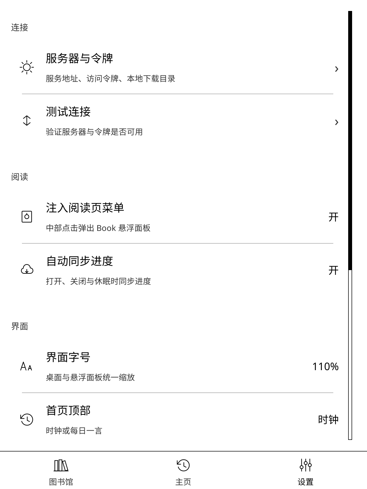
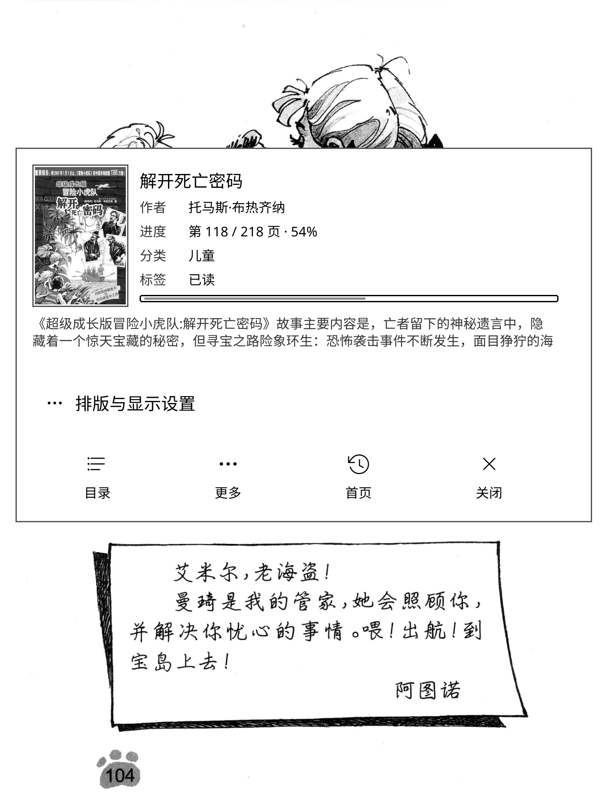

# Book 书库

Book 是一个 [KOReader](https://koreader.rocks/) 插件，为 KOReader 提供连接远端阅读服务的书库桌面。它将图书馆、首页、统计和设置整合为全屏界面，可下载并打开书籍、缓存封面，以及同步阅读进度。

架构上通过统一 **Source** 接口支持多数据源扩展（Book 服务、微信读书、WebDAV）；**Book 服务（moon）完整实现**；**微信读书支持书架/按章阅读**（扫码登录即可，正文通道为逆向协议，可能随时失效）；WebDAV 仅配置+连接测试。同时只激活一个数据源；书城 Tab 按源能力动态显示。

配套服务端：[AnkioTomas/book](https://github.com/AnkioTomas/book)（静读天下 Web 管理）。本插件通过其 HTTP API 拉取书库、封面与进度；请先部署该服务，再在插件设置中填写服务器地址与令牌。

## 截图

| 主页 | 图书馆 |
| --- | --- |
|  |  |

| 设置 | 阅读页悬浮面板 |
| --- | --- |
|  |  |

## 功能

- **封面书库**：以响应式网格展示书籍、阅读进度和总数，支持分页。
- **搜索与筛选**：按书名/作者搜索，或按分类、标签、系列、作者筛选。
- **主页概览**：最近阅读和在读书籍。
- **多维统计**：从服务端拉取阅读 KPI、月度/星期分布与日历热力，点选日期查看当日书单。
- **书籍详情**：查看作者、分类、标签、系列、进度和简介后再开始阅读。
- **下载与缓存**：书籍按 `bookKey=md5(source:stableId)` 落盘到 `.moon/cache/<source>/book/<key>/`（整本 `book.*` 或章节 `N.html`）；元数据 / 目录 / 打开映射 / HTTP 缓存在 `.moon/book.sqlite3`（meta TTL 7 天 / toc TTL 1 天）。首次打开可显示下载进度。按章源通过 `fetchChapterContentAsync` 交标准正文，宿主统一写 HTML 并支持章末/章首连续换章与前1后3预取。
- **微信读书按章阅读**：拉取详情与目录后按章生成 EPUB；阅读中支持上一章/下一章与后台预取（前 1 后 3）。仅供个人学习研究，请遵守微信读书用户协议。
- **进度同步**：可在打开书籍时拉取远端进度，并在关闭书籍或设备休眠时上传进度。
  - **阅读统计上报**：复用 KOReader「阅读统计」插件的 `statistics.sqlite3`，在关闭/休眠时将页停留时长与页数上报到服务端高维统计接口（可手动立即上报）。
- **阅读页面板**：触摸设备可在阅读页中部点按打开 Book 悬浮面板，快速调整字体、字号、行距、字重、对比度、边距和滚动/分页模式，并可进入目录、系统更多设置或返回书库。
- **启动入口**：可从 KOReader 主菜单、文件管理器“+”菜单或调度器动作打开；也可设为启动时默认打开。
- **缓存管理**：首次进入主页时自动清理连续 90 天未打开的本地书籍及其封面，也可在设置中手动清空所有插件缓存。
- **显示适配**：针对墨水屏优化的色阶与布局，可在设置中循环调整界面字号（100%–180%）。

## 安装

1. 将 `book.koplugin` 目录复制到 KOReader 的插件目录：

   ```text
   <KOReader 数据目录>/plugins/book.koplugin
   ```

2. 重启 KOReader。
3. 从主菜单的 **Book 桌面** 打开插件。

> 插件运行在 KOReader 的 Lua 环境中，不需要单独安装 Java、Node.js 或其他项目依赖。

开发、本机模拟器调试与贡献流程见 [DEVELOPMENT.md](DEVELOPMENT.md)。

## 配置

首次打开后，进入底部 **设置** 标签页：可切换 **数据源**（当前仅 Book 服务可用），再选择 **服务器与令牌**，填写：

| 配置项 | 说明 |
| --- | --- |
| 服务器地址 | Book 服务的基础 URL，例如 `https://book.example.com`；末尾 `/` 会被自动忽略。 |
| 令牌 | 服务端签发的 Bearer 长期令牌。 |
| 本地下载缓存目录 | 已下载书籍与封面缓存的保存位置；默认是 KOReader 数据目录下的 `books`。 |

保存后可使用 **测试连接** 验证配置。设置页还可控制阅读页悬浮菜单、自动同步进度、自动上报阅读统计、启动时打开桌面、主页顶部内容和界面字号；在 **清理缓存** 中可删除所有已下载书籍和封面，不会影响服务器数据。

## 使用

### 浏览与阅读

1. 在 **首页** 查看最近阅读和在读书籍，或切换到 **图书馆** 浏览藏书；**统计** 页从当前数据源拉取多维阅读数据（Book 源走服务端 insight）。
2. 点按首页中的“已读”或“未读”统计可直接进入对应筛选后的图书馆；也可在图书馆顶部使用搜索、筛选或清除筛选。左右滑动可切换页面。
3. 点按一本书打开详情页，然后选择 **开始阅读**。书籍不存在于本地时会显示下载进度并自动下载。

> 支持书城能力的数据源会在底栏显示 **书城**；当前 Book 源不显示该书城入口。

### 阅读页悬浮菜单

默认启用且仅适用于触摸设备。阅读时点按屏幕中部区域可打开 Book 悬浮面板，进行常用排版调整、查看目录、进入 KOReader 更多阅读设置，或选择 **首页** 关闭当前书籍并返回 Book 桌面。

如需保留 KOReader 默认的中部翻页行为，可在 **设置 → 注入阅读页菜单** 中关闭此功能。

### 进度同步

启用“自动同步进度”后，插件会在打开书籍时尝试从服务器恢复进度，并在关闭文档或设备休眠时上传当前进度。也可以通过 KOReader 调度器中的 **打开 Book 桌面** 动作进入书库。

### 阅读统计上报

启用“自动上报阅读统计”后，插件会在关闭文档或设备休眠时，在后台把 KOReader 阅读统计库中的数据上传到服务端（JSON，`/index/stats/import`）。设置里点 **立即上报阅读统计** 同样走后台分步上传，并显示进度条。

上报以 **filename**（书库相对路径）为书籍主键。payload 只含：
- `books[]`: `{ filename, title?, authors? }`
- `stats[]`: `{ filename, page, start_time, duration, total_pages, device_id? }`

插件通过 `books.md5`→`books.filename` 与 opens 映射解析远端 filename；服务端用 filename 匹配书库书名与作者，匹配不到才用上报回退值。

前置条件：

1. 设备上启用 KOReader「阅读统计」插件，并已产生 `statistics.sqlite3`。
2. 对应书籍曾通过 Book 桌面打开/下载过（以便建立 filename 映射）。无法解析 filename 的条目会被跳过。

进度同步与统计上报是两条管道：前者按 `filename` 更新阅读位置，后者按同一 `filename` 累积时长与页数。

## 服务端接口

默认对接 [AnkioTomas/book](https://github.com/AnkioTomas/book)。插件以 `Authorization: Bearer <token>` 请求服务器。除封面和书籍下载外，接口应返回 JSON；成功响应使用 `code: 200`，业务错误应提供 `msg` 字段。

| 方法 | 路径 | 用途 |
| --- | --- | --- |
| `GET` | `/index/auth/ping` | 测试令牌和连接。 |
| `GET` | `/index/book/list` | 分页书籍列表；支持 `page`、`pageSize`、`search`、`series`、`category`、`favorite`、`finished`、`author` 查询参数。 |
| `GET` | `/index/book/recent` | 最近阅读书籍，使用 `limit` 参数。 |
| `GET` | `/index/book/filters` | 分类、标签、系列和作者筛选项。 |
| `GET` | `/index/book/progress` | 获取书籍进度，使用 `filename` 参数。 |
| `POST` | `/index/book/progressUpdate` | 更新进度，表单字段包括 `filename`、`frac`、`spine`、`page`、`percent`。 |
| `GET` | `/index/book/file` | 下载书籍文件，使用 `filename` 参数。 |
| `GET` | `/webdav/{filename}` | 下载封面图片；文件名中的路径段会进行 URL 编码。 |
| `POST` | `/index/stats/device` | 注册阅读设备，JSON：`{ id, model }`。 |
| `POST` | `/index/stats/importMoon` | 上传静读天下 `.mrpro` 备份（multipart `file`）；按天写入 page_stat。设备 ID 取备份 `deviceRandomID2`（前缀 `moon-`），缺则失败；每次导入会 DROP 历史误用的 `moon-import`，并替换该设备旧数据。 |
| `GET` | `/index/stats/summary` | 阅读活动汇总 KPI。 |
| `GET` | `/index/stats/insight` | 多维统计页数据：KPI、月/星期分布、按日 perDay。 |
| `GET` | `/index/stats/book` | 单书 page_stat，查询参数 `filename`。 |

下载前，插件会尝试以 `HEAD /index/book/file?filename=...` 获取 `Content-Length` 以显示进度；服务端不支持 `HEAD` 或未返回长度时，下载仍可正常进行。

书籍列表中的常用字段包括 `filename`、`bookName`、`author`、`favorite`、`category`、`series`、`description` 和 `progressPercent`。最近阅读接口返回的数据用于主页的最近阅读和在读区域。

## 本地数据

插件配置在 `$DATA/.moon/settings/`（`common.lua` 与各源文件）。结构化数据在 `$DATA/.moon/book.sqlite3`（`books` / `tocs` / `opens` / `http`）。正文与封面在 `$DATA/.moon/cache/<source>/`。

首次进入主页时，插件会异步删除连续 90 天未打开的本地书籍及相应封面。**设置 → 清理缓存** 会清空缓存目录与 tocs/opens/meta 字段，但保留 `books.filename` / `books.md5`，也不会删除服务器端内容。

## 版本号

插件版本写在 `book.koplugin/bookversion.lua`（故意不用 `version.lua`，以免和 KOReader 自带模块冲突）。未注入时为 `0.0.0-dev`；设置页 **关于** 会显示该版本。

外部打包时注入示例：

```bash
# 整文件覆盖（推荐）
VERSION=1.2.3
printf 'return "%s"\n' "$VERSION" > book.koplugin/bookversion.lua

# 或替换占位符
sed -i.bak "s/@VERSION@/${VERSION}/g" book.koplugin/bookversion.lua
```

## 许可证

本项目采用 [MIT License](LICENSE)。
