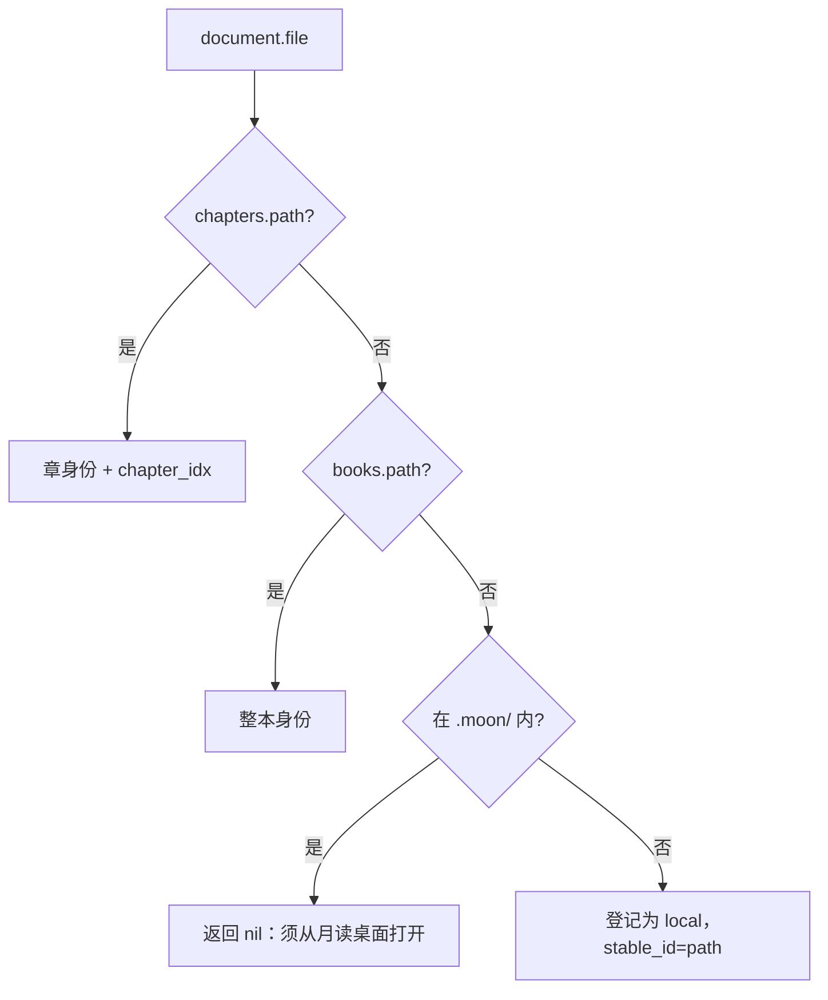

# book.store — 身份与登记

代码：[`book/store.lua`](../../book.koplugin/book/store.lua)。表：[`books`](../db/books.md)、[`chapters`](../db/chapters.md)。

## 设计

所有业务状态挂在 `(source_id, stable_id)` 上。Reader 打开的是物理文件，所以身份解析只有一条规则：**用文档绝对路径精确查库**。



`ensureIdentity` 在解析成功后还会：

1. `registry.resolve(source_id)` → 写入 `identity.source`（current 匹配则复用，否则建非活跃实例）
2. `BookDB.touchPath` 刷新打开时间

`.moon` 内未知文件返回 `nil`（缓存残片不能猜身份）。`.moon` 外未入库文件当 local 登记：已有行只补 path，不覆盖元数据。

文件落地后必须 `Store.touch` **同步**写库，成功才能交给 Reader——否则 ReaderReady 无法恢复可靠身份。

`touch` 新建行语义：`deleted=1`（仅身份/路径，不误上架）。真正上架走扫盘 `upsert` 或远端 reconcile。

---

## 用法

```lua
local Store = require("book.store")

-- ReaderReady
local identity = Store.ensureIdentity(ui.document.file)
if not identity then
    -- 弹「请从月读打开」
    return
end
-- identity.source_id / stable_id / chapter_idx? / book? / source?

-- 源下载或准备好文件后（同步！）
local ok, err = Store.touch(path, identity, {
    chapter_idx = 3,          -- 按章必填；整本省略
    toc = chapters,           -- 可选，写入 books.toc
    book = latest_meta,       -- 可选，一并刷新元数据
})
if not ok then cb(nil, err); return end
cb(path)

-- 远端书架快照对账
local result, err = Store.reconcile(source.id, remote_books)
-- result: { pulled, pushed=0, hidden, conflicts=0, skipped }

-- 列表/详情里临时记一批元数据（不改变书架成员逻辑的远端 upsert）
Store.rememberMany(books)

-- 异步回调：用户是否还在看同一本（含同一章）
if not Store.isCurrentDocument(ui, identity) then return end
```

### API

| API | 返回 | 说明 |
|---|---|---|
| `identityFor(path)` | `BookIdentity?` | 只查库，不 resolve 源、不登记 |
| `ensureIdentity(path)` | `BookIdentity?` | 查库 + resolve 源；必要时登记 local |
| `touch(path, identity, opts?)` | `ok, err` | 整本写 `books.path`；按章事务写 path + chapters + 可选 toc |
| `toc(identity)` | `BookChapter[]?` | 解码 `books.toc` |
| `allChaptersCached(identity)` | bool | toc 长度 == chapters 行数；toc 未知则 false |
| `isDownloaded(book)` | bool | 章源看全章缓存；整本看 `path` |
| `reconcile(source_id, books)` | `SyncResult?, err` | 远端快照对账 |
| `rememberMany(books)` | — | `upsertRemoteMany` |
| `markDeleted(source_id, stable_id)` | — | 软删 + 清工作目录/章缓存 |
| `finalizeDeleted(...)` | — | 云端真删成功后撕墓碑 |
| `isCurrentDocument(ui, identity)` | bool | 比 source/stable/chapter |

### 注意

- 打开旧源书之后同步，必须用 `identity.source`，不要 `Registry.current()`。
- local：`stable_id == path`；改名靠 `md5` + 扫盘 `renameStableId`。
- `touch` 失败就停止打开链路，不要「先开再说」。
