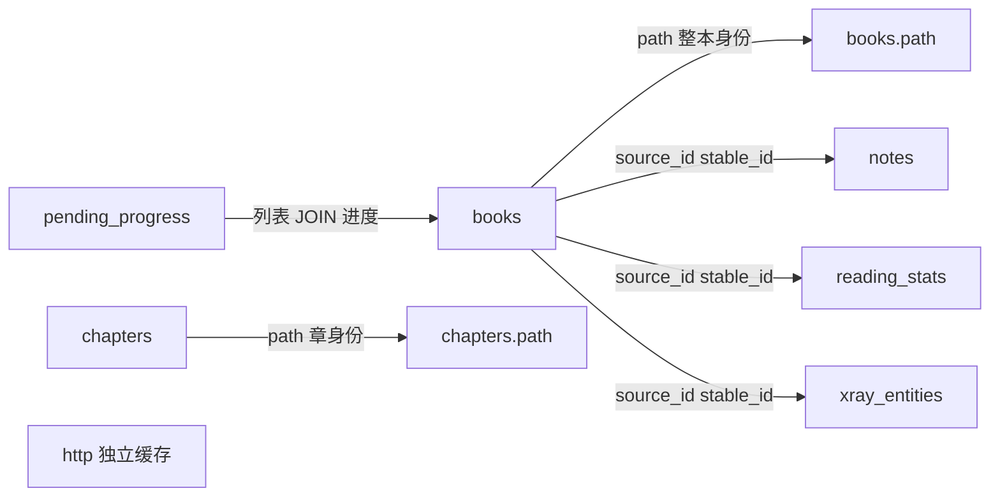

# book.sqlite3 表设计

主库路径：`$DATA/.moon/book.sqlite3`（`utils.paths.dbPath()`）。

连接与建表由 [`book.koplugin/db/base.lua`](../../book.koplugin/db/base.lua) 管理：WAL、`busy_timeout=5000`；`open` 时按固定顺序 `ensureSchema`，任一步失败整事务回滚。禁止在 `workers.job` 子进程访问本库。

本目录只覆盖主库。IME 词库 `dictionary*.sqlite3` 另属输入法，不在此文档集。

## 建表顺序

```text
db.book → db.chapter → db.http → db.note → db.progress → db.stats → db.xray
```

对应表：`books` → `chapters` → `http` → `notes` → `pending_progress` → `reading_stats` → `xray_entities`。

## 表索引

| 表 | 文档 | 一句话职责 |
|---|---|---|
| [`books`](books.md) | 书籍身份、书架成员（软删+sync_status）、展示元数据、目录/排版缓存 |
| [`chapters`](chapters.md) | 章节文件 path → 书身份 + 章号 |
| [`pending_progress`](pending_progress.md) | 一书一条阅读进度真源（含同步脏标记） |
| [`notes`](notes.md) | 书/章注解完整快照（含同步脏标记） |
| [`reading_stats`](reading_stats.md) | 阅读统计事件与云端合成桶（含同步脏标记） |
| [`http`](http.md) | HTTP GET 响应缓存 |
| [`xray_entities`](xray_entities.md) | 书级 X-Ray 实体（仅本地） |

## 跨表关系

跨源身份一律 `(source_id, stable_id)`。`books` 是元数据与成员的落点；进度/笔记/统计/X-Ray 按同一身份挂靠。



身份解析铁律（见 `book/store.lua`）：先查 `chapters.path`，再查 `books.path`；都不中则按是否在 `.moon` 内拒开或登记为 local。

## 同步总规则

| 域 | 脏标记 | 编排入口 |
|---|---|---|
| 书架成员 / 展示 | `books.sync_status`（`deleted` 软删） | `syncBooksAsync` / `Store.reconcile` |
| 进度 | `pending_progress.sync_status` | `book.progress` → `syncProgressAsync` |
| 笔记 | `notes.sync_status` | `book.note` → `syncNotesAsync` |
| 统计 | `reading_stats.sync_status` | `book.stats` → `syncStatsAsync` |
| HTTP / X-Ray | 不同步 | — |

`sync_status`：`0` = 待上传，`1` = 已与远端收敛。

统一契约：**本地优先 push，再 pull**。

| 域 | Push | Pull |
|---|---|---|
| 书架 / 统计 | 全量先推后拉；`retryDirtyAsync` / `dirty_only` 只推 | 全量同步时 |
| 进度 | 关书 / 脏重试 / 面板：只推 | **仅开书** `Progress.pull`（冲突让用户选） |
| 笔记 | 有网即推（划线 / 关书 / 脏重试） | **仅开书** `Note.pull` |

编排见 `book.sync`：进度/笔记域永远 `dirty_only`。书架脏位只在单条 add/delete 推送成功时清除，禁止整源盲清。

UI 查询默认只读 SQLite（`book.catalog` / SourceBase 默认查询）；远端结果必须先写回本地再供展示。
