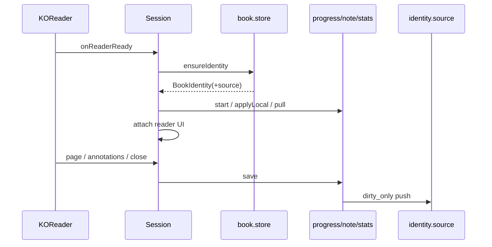

# ui.reader.session — 阅读会话

代码：[`ui/reader/session.lua`](../../book.koplugin/ui/reader/session.lua) 及 `session/{chapter,snapshot,mode,toc,document_toc}.lua`。

## 设计

书籍级会话门面：身份自举、统计/注解/进度、切章、关书结清、向属主源发事件。  
是否按章**只看** `identity.chapter_idx`（`Mode.isChapter`）。

| 对象 | 寿命 |
|---|---|
| `ReaderSessionSnapshot` | 单个文档 ReaderReady → CloseDocument |
| `ReaderChapterSession` | 跨 `switchDocument` 保留，直到真关书 |



关书路径（`document_close` / `suspend`）对 progress、notes、stats **一律只推不拉**——远端收敛延迟会用旧值盖掉刚上传的新值。完整 pull 留给下次开书。

切章导航带 `skip_pull`，避免每章都拉云端。

已读：`fraction>=1` 或 EndOfBook → `markReadComplete`；可选设置 `auto_mark_read_at_99` 在 99% 且 `read_state==0` 时自动已读。安装自定义 EndOfBook，屏蔽 KOReader 默认结束菜单。

`.moon` 内无法识别的文件：ConfirmBox「关闭文档 / 仍要阅读」。

---

## 用法

`main.lua` 接线（不要在 main 里写业务）：

```lua
function BookPlugin:onReaderReady()
    require("ui.reader.session").onReaderReady(self)
end
function BookPlugin:onCloseDocument()
    require("ui.reader.session").onCloseDocument(self)
end
function BookPlugin:onPageUpdate(page)
    require("ui.reader.session").onPageChanged(self, page)
end
function BookPlugin:onAnnotationsModified(items)
    require("ui.reader.session").onAnnotationsModified(self, items)
end
function BookPlugin:onSuspend()
    require("ui.reader.session").onPause(self)
end
function BookPlugin:onResume()
    require("ui.reader.session").onResume(self)
end
```

会话内查询与切章：

```lua
local Session = require("ui.reader.session")

local snap = Session.current()          -- 只读，别改字段
Session.isChapterMode(identity)
Session.toc()
Session.chapterIndex(snap)
Session.chapterTitle(snap)
Session.remainingSeconds()

Session.gotoChapter(idx, { within = 0.0 })
Session.onChapterBoundary(1)           -- 页尾下一章；-1 上一章
```

开书 bootstrap（内部）：

```text
Stats.start
ui.reader.onCreate
Note.applyLocal          -- 同步，首绘前
若非 skip_pull:
  Progress.pull
  Note.pull
章模式: ChapterMode.afterBootstrap（预取等）
```

关书结清（内部 `syncReading`）：

```text
Progress.save → source:syncProgressAsync(dirty_only)
Note.save → source:syncNotesAsync(dirty_only)
Stats.stop → source:syncStatsAsync(dirty_only)
emitToSource(event, nil, identity.source)
真关书: Progress.clearConflicts()；清章节会话
```

阅读 UI：[`ui/reader.lua`](../../book.koplugin/ui/reader.lua)（panel / bars，仅会话活跃时注册触控区）。

### 注意

- 所有源事件第三参传 `identity.source`。
- 切章不是真关书：快照会重建，章会话与冲突记忆策略不同。
- 异步回调用 `Store.isCurrentDocument` 丢弃旧结果。
